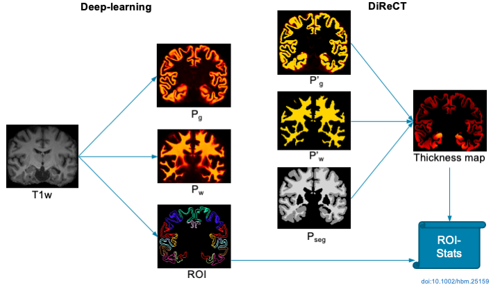

# About DL+DiReCT

DL+DiReCT combines a deep learning-based neuroanatomy segmentation and cortex parcellation with a diffeomorphic registration technique to measure cortical thickness from T1w MRI.



If you are using DL+DiReCT in your research, please cite ([bibtex](doc/cite.bib)) the corresponding [publication](https://doi.org/10.1002/hbm.25159):
```
Rebsamen, M, Rummel, C, Reyes, M, Wiest, R, McKinley, R.
Direct cortical thickness estimation using deep learning‐based anatomy segmentation and cortex parcellation.
Human brain mapping. 2020; 41: 4804-4814. https://doi.org/10.1002/hbm.25159
```


# Installation
## Create virtual environment (optional)
Download and install [Miniconda](https://conda.io/projects/conda/en/latest/user-guide/install/linux.html) and create a new conda environment:
```bash
conda create -y -n DL_DiReCT python=3.7
source activate DL_DiReCT
```

## Install DL+DiReCT
```bash
git clone https://github.com/SCAN-NRAD/DL-DiReCT.git
cd DL-DiReCT
pip install -e .
```

## Install HD-BET for skull-stripping (optional)
If you want to use [HD-BET](https://github.com/NeuroAI-HD/HD-BET/) for skull-stripping, you may optionally install it with:
```bash
cd ${HOME}
wget https://github.com/NeuroAI-HD/HD-BET/archive/master.zip
unzip master.zip && rm master.zip
cd HD-BET-master
pip install -e .
```

# Usage
Run dl+direct on a T1-weighted MRI including skull-stripping (--bet) with:
```bash
source activate DL_DiReCT
dl+direct --subject <your_subj_id> --bet <path_to_t1_input.nii.gz> <output_dir>
```

Following files of interest are generated in the output directory:
```
- T1w_norm.nii.gz		Re-sampled input volume
- T1w_norm_seg.nii.gz		Segmentation
- T1w_norm_thickmap.nii.gz	Thickness map
- deepscan_volumes.csv		Segmentation volumes
- result-thick.csv		ROI-wise mean cortical thickness
- result-thickstd.csv		ROI-wise standard deviations of cortical thickness
```

# [Frequently Asked Questions](doc/faq.md)
For further details, consult the corresponding [publication](https://doi.org/10.1002/hbm.25159) and the [FAQ](doc/faq.md) or [contact us](http://www.scancore.org/index.php/research/imageanalytics)
